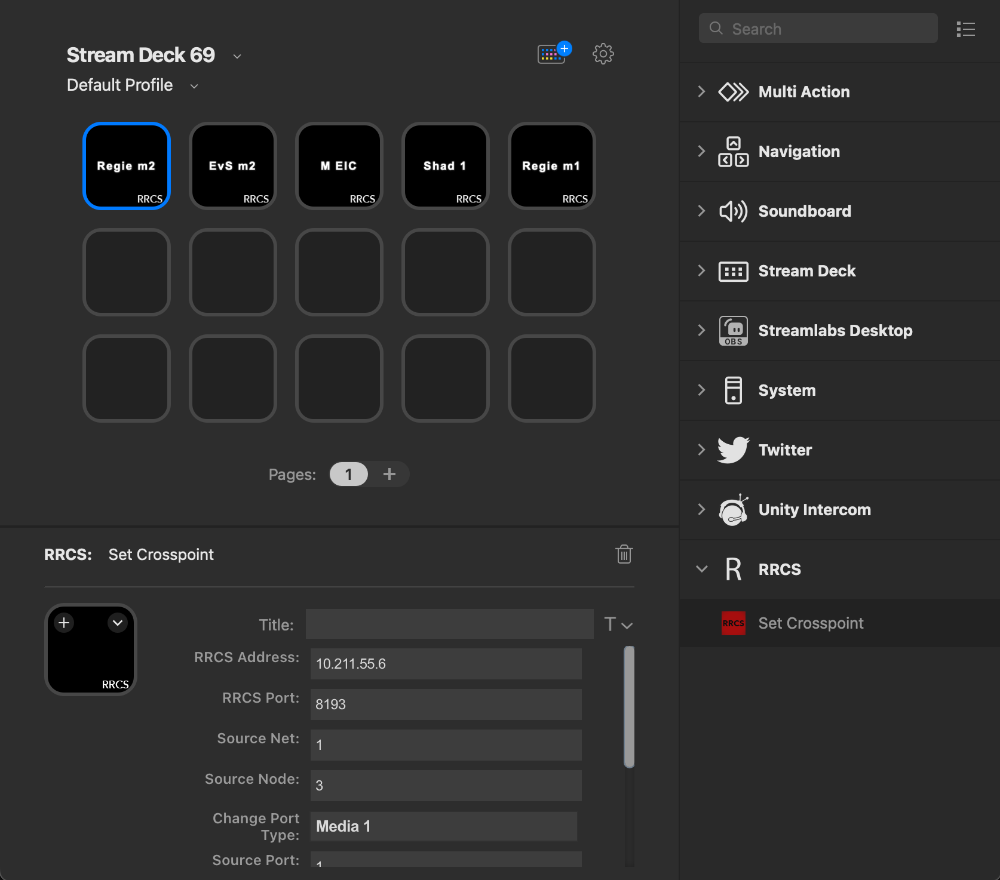

# `STREAMDECK - RRCS`

STREAMDECK - RRCS is a [Stream Deck](https://elgato.com) plugin that lets you turn a Streamdeck into a remote [Riedel](https://riedel.net) Panel.

# Features

- set crosspoints in Riedel Artist Matrix

# Installation

In the Release folder, you can find the file `de.lucas-kirsche.rrcssd.streamDeckPlugin`. If you double-click this file on your machine, Stream Deck will install the plugin.

# Source code

The Sources folder contains the source code of the plugin.
